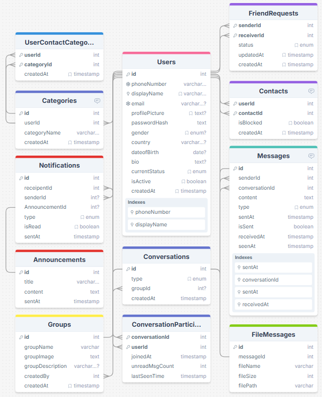
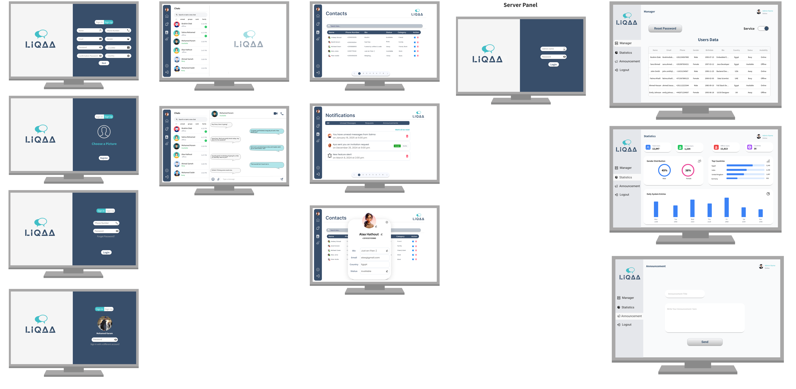

# Liqaa Chat Application

## Overview
Liqaa is a feature-rich JavaFX-based chat application that enables secure real-time communication between users. The application supports both one-to-one and group messaging, file sharing, and various user management features.

## Features

### Core Features
- **User Authentication**
  - Phone number-based registration and authentication
  - Secure password management
  - Remember me functionality
  - Profile management (display name, email, picture, bio)

- **Messaging**
  - One-to-one chat
  - Group chat support
  - Rich text messages with formatting options
  - File transfer capabilities (text, sound, video, etc.)
  - Message status indicators (sent/delivered/seen)

- **Contact Management**
  - Phone number-based contact adding
  - Online/Offline status tracking
  - Custom status modes (Available, Busy, Away)
  - Contact blocking functionality

- **Notifications**
  - Real-time contact status updates
  - New message notifications
  - System announcements

### Additional Features
- **Server Administration**
  - User statistics tracking
  - System-wide announcements
  - Service management
  - User data management

## Technology Stack
- **Frontend**: JavaFX with CSS, FXML and Scene Builder.
- **Backend**: Java
- **Communication**: Java RMI (Remote Method Invocation)
- **Build Tool**: Maven (Multi-module project)
- **Database**: MySQL
## Project Structure
```
liqaa/
├── client/               # Client-side application
│   ├── controllers/      # UI controllers
│   ├── network/          # Network communication
│   ├── services/         # Business logic
│   └── view/             # FXML and resources
├── server/               # Server-side application
│   ├── controllers/      # Server controllers
│   ├── repositories/     # Data access layer
│   ├── services/         # Business logic
│   └── network/          # Network handling
└── shared/               # Shared components
    ├── exceptions/       # Custom exceptions
    ├── models/           # Data models
    └── network/          # Network interfaces
```

## Database Schema
For better quality: [Schema](https://drawsql.app/teams/iti-41/diagrams/chatting-app)


## UI Wireframes


## GIF Demo


## Installation and Setup

### Prerequisites
- Java Development Kit (JDK) 17 or higher
- Maven 3.6 or higher
- MySQL Server 8.0 or higher

### Building the Project
1. Clone the repository:
```bash
git clone https://github.com/yourusername/liqaa.git
```

2. Navigate to the project directory:
```bash
cd liqaa
```

3. Build the project using Maven:
```bash
mvn clean install
```

### Running the Application
1. Start the server:
```bash
java -jar server/target/server-1.0-SNAPSHOT.jar
```

2. Launch the client:
```bash
java -jar client/target/client-1.0-SNAPSHOT.jar
```

## Configuration
- Database configuration can be modified in `server/src/main/resources/datasource.properties`
- Server connection settings are in `shared/src/main/java/com/liqaa/shared/models/APIConfig.java`

## Development Team
- Ibrahim Diab (Project lead)
- Mohamed Karam
- Alaa hathout
- Salma Abdelnaser

## License
This project is licensed under the MIT License.


